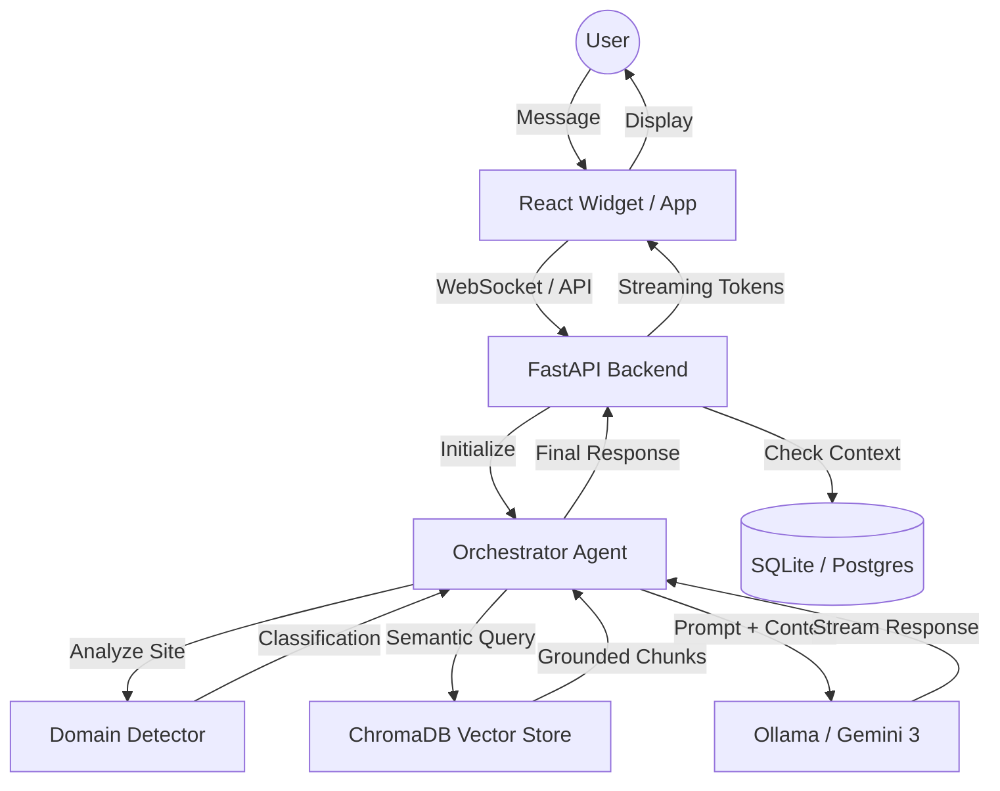

# TiO System Architecture

This document provides a high-level overview of the TiO system architecture, illustrating the flow of data from user input to grounded response.

## System Workflow Diagram

## Core Components

### 1. The Orchestrator
The central brain of the system. It handles conversation state, memory retrieval, and LLM prompting. It is designed to be "domain-aware," meaning it adjusts its logic based on the type of website it is currently serving.

### 2. Domain Intelligence
A specialized utility that classifies the input data into one of several predefined domains (Tourism, Medical, etc.). This classification determines the **Behavior Profile** used by the LLM, ensuring the tone and constraints match the industry standards.

### 3. Vector Retrieval (RAG)
Uses **ChromaDB** to store and retrieve document embeddings. The retrieval process includes filtering and re-ranking to ensure only the most relevant "ground truth" is used for generation.

### 4. Admin Intelligence
A separate monitoring layer that captures logs and system stats without interrupting the main chat flow. It provides a real-time window into the system's operational health.
